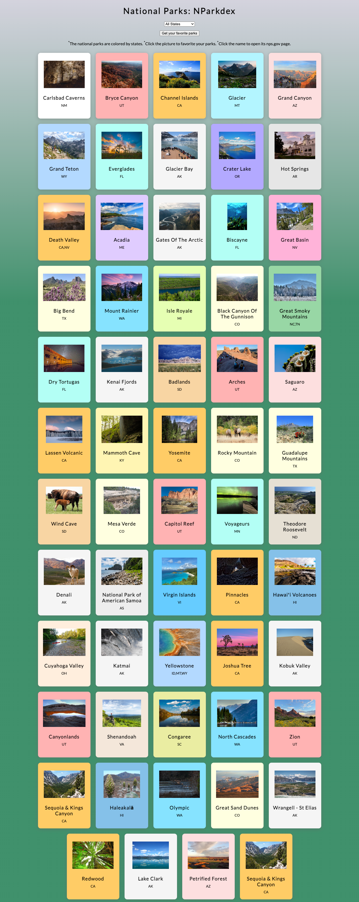
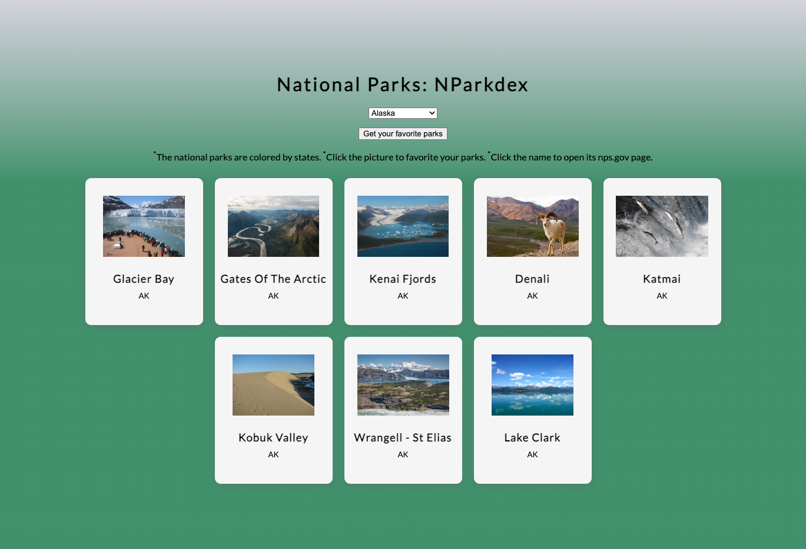
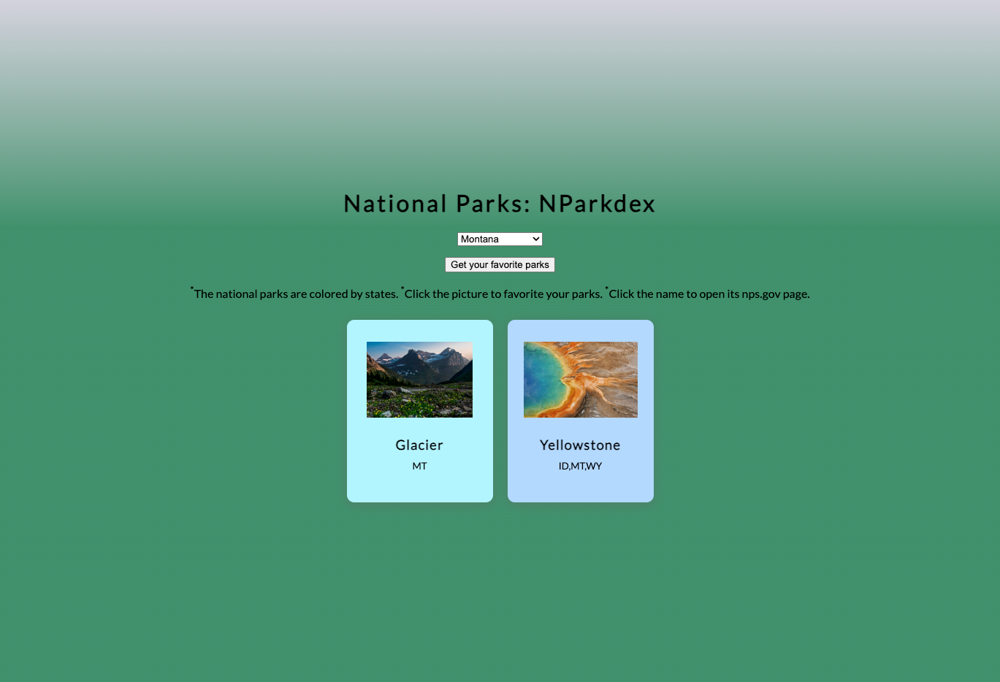
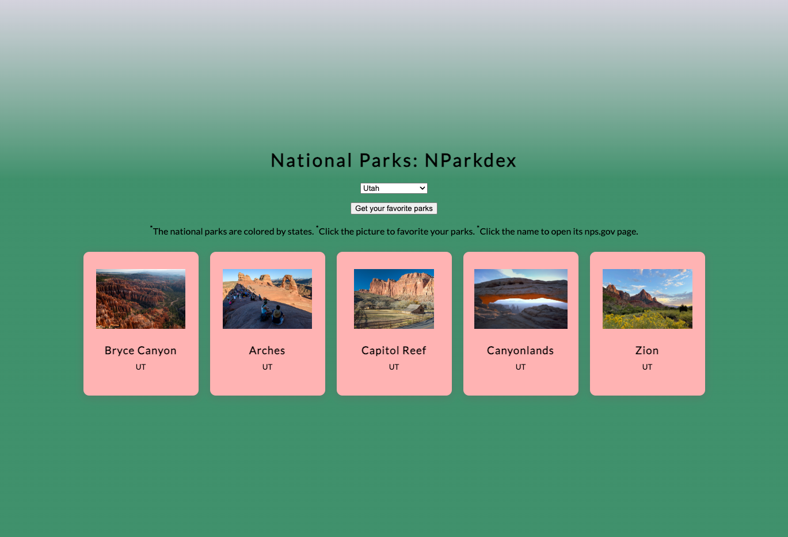
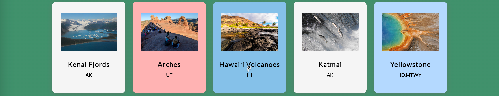
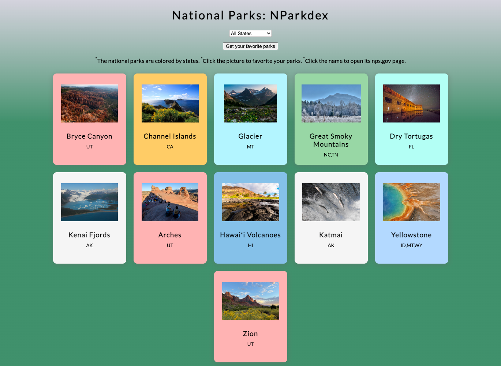

# National Park Cards (NParkdex)

## Description
NParkdex is a web application that displays information about national parks in the United States. Users can filter parks by state, mark their favorite parks, and view park details on the National Park Service website.

## Features
- Display national parks with images and basic information.
- Filter parks by state.
- Mark favorite parks by clicking on the park image.
- View park details on the National Park Service website by clicking on the park name.
- Get a list of favorite parks.  

## Files
- ```main.html```
- ```main.js```
- ```style.css```
- ```states.js```
- ```colors.js```
- ```README.md```
- ```excel-2-json.py```: convert .xlsx file into .json file.
- ```excel-2-txt.py```: convert .xlsx file into .txt file.
- ```NPS-Unit-List.xlsx```
- ```NPS-Unit-List.json```
- ```NPS-Unit-List.txt```



## Usage
1. Open ```main.html``` in a web browser.
2. Use the state filter dropdown to filter parks by state.  



3. Click on a park image to mark it as a favorite.

4. Click on the park name to visit the park's page on the National Park Service website.

5. Click "Get your favorite parks" to view a list of favorite parks.


## Requirements
- Web browser
- Internet connection

## Credits
- National Park Service API for park data.

